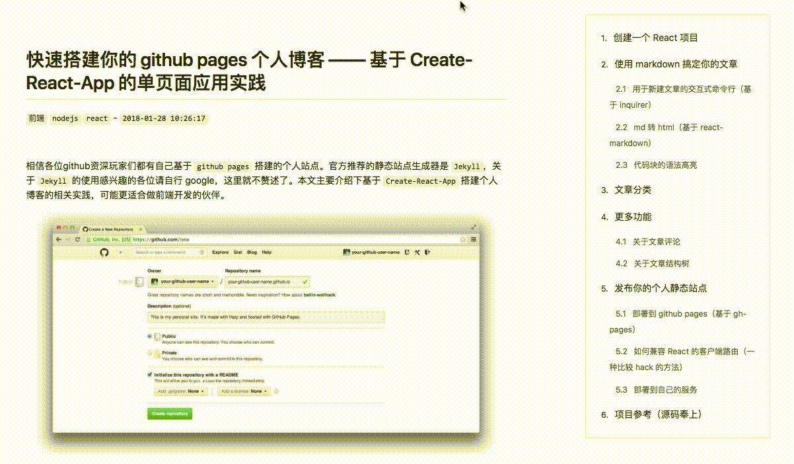

# Markdown-Navbar

Best markdown navbar component for React.

## Screenshots



[Demo online](https://parksben.github.io/post/2018-01-28T10:26:17_create-a-react-blog)

## Instructions

This UI component needs to be used in **conjunction** with your article content. When using this component, you must ensure that your article under the same page content.

## Install

```
yarn add markdown-navbar
```
or

```
npm install markdown-navbar
```

## Usage

```js
import MarkNav from 'markdown-navbar';
import 'markdown-navbar/dist/navbar.css';

const content = '## Heading One...\n\n## Heading Two...\n';

<MarkNav
  className="article-menu"
  source={content}
  headingTopOffset={80}
/>
```

## Options

|property|type|default value|use|
|:-:|:-:|:-:|:-:|
|className|string|""|The className that defines the outermost container of navbar|
|source|string|""|Markdown text content|
|headingTopOffset|number|0|Anchor displacement relative to the top of the window (for the anchor jump)|
|ordered|boolean|true|Whether the title contains a numerical prefix, such as: `1. 2. 2.2`|

## License

`Markdown-Navbar` is released under the MIT license.
